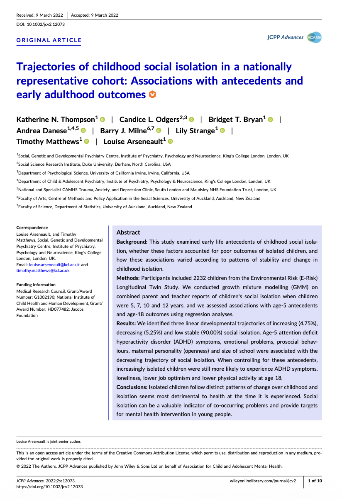
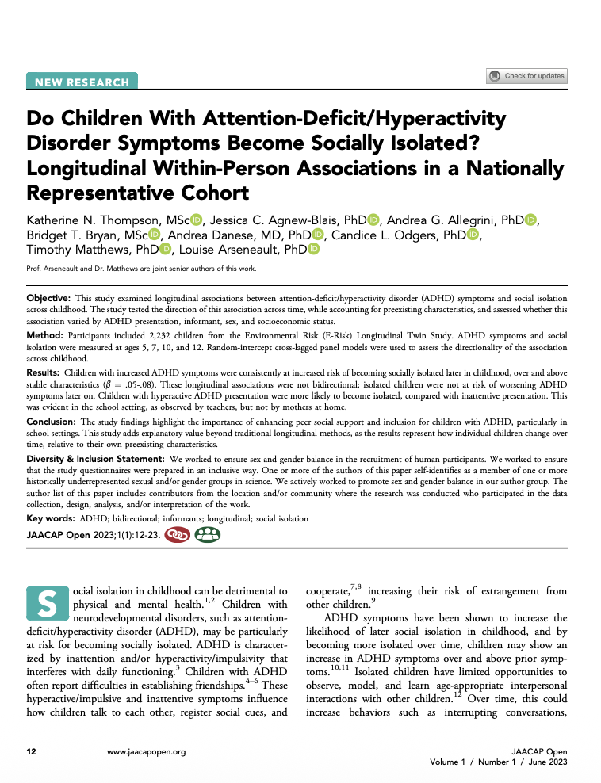
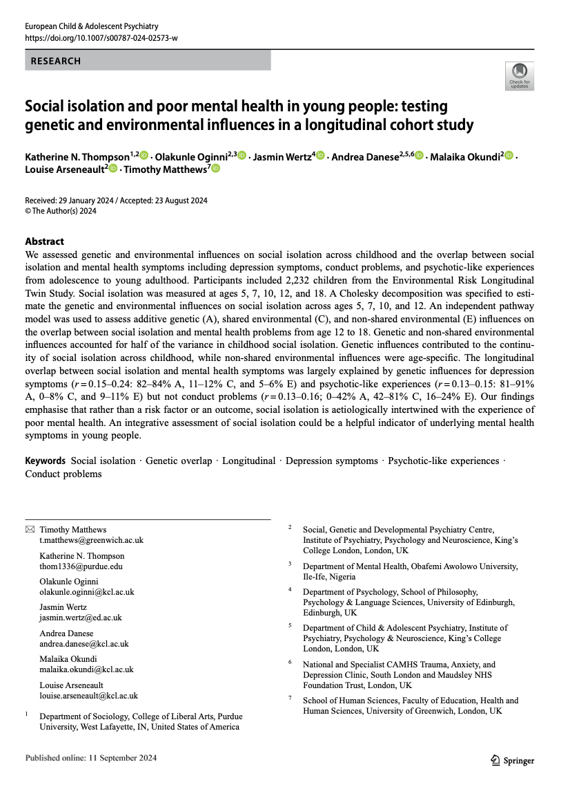
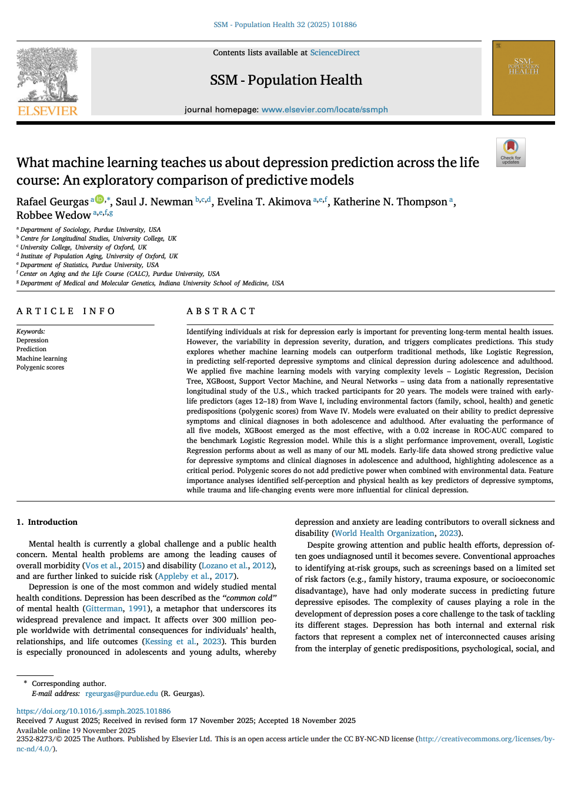
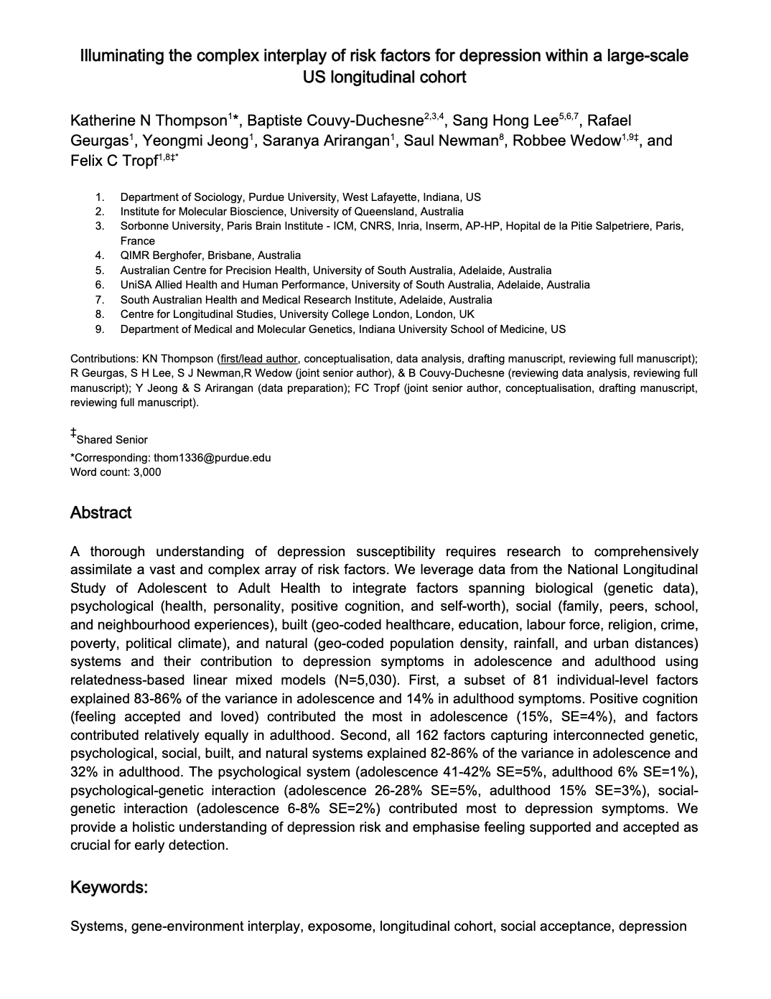
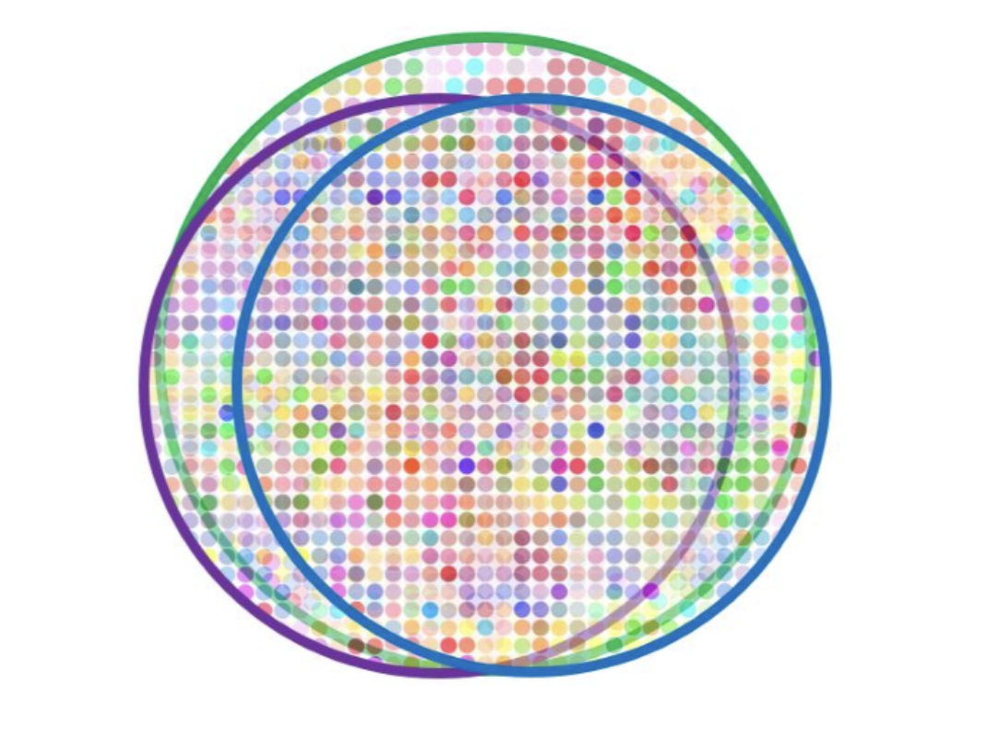
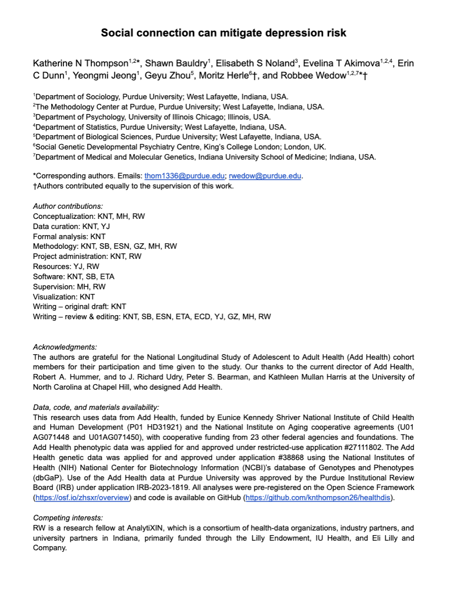
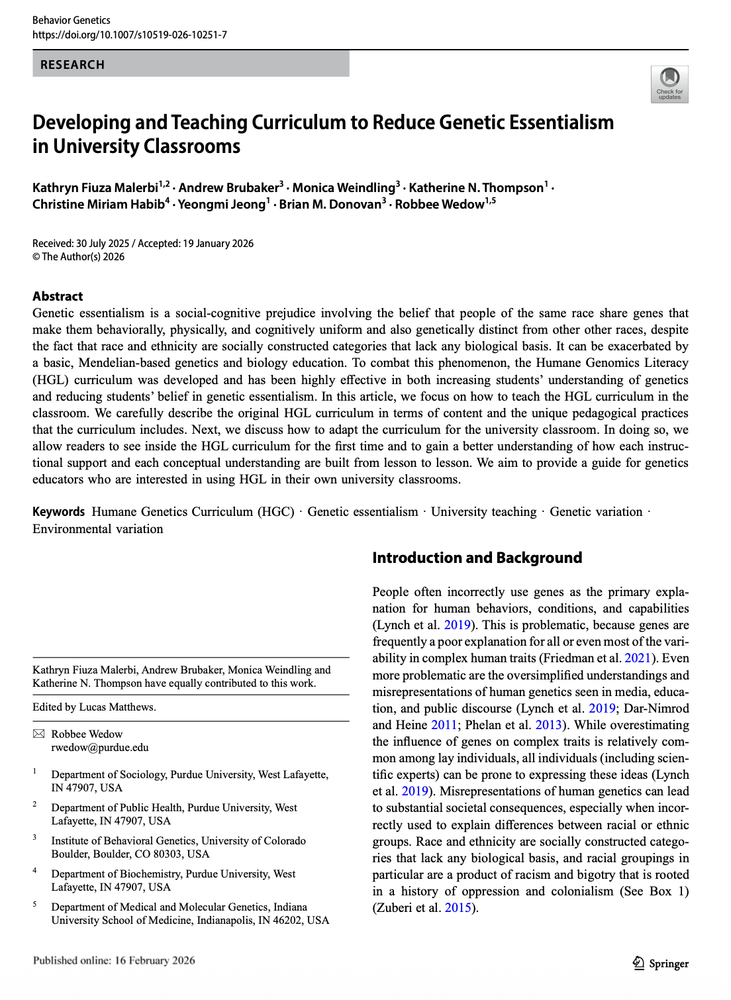
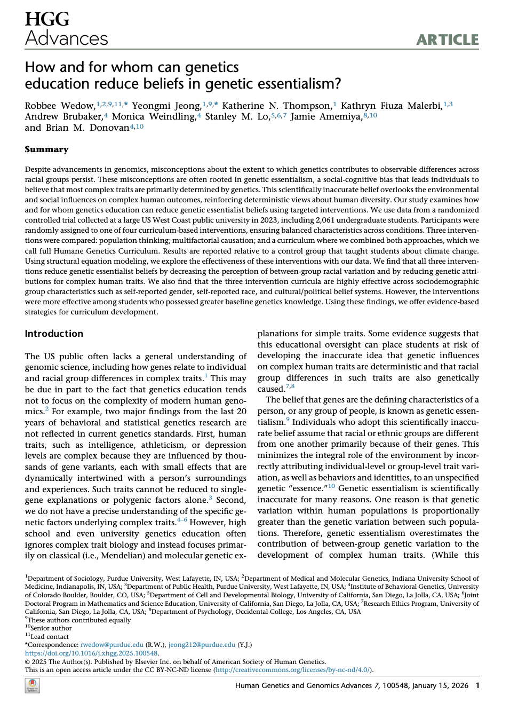

My work intersects psychiatry, genomics, and sociology to better understand mental health.

**I lead three programs of research:**

### Social isolation and mental health

To understand the link between experiences of social isolation and mental health from childhood to young adulthood.

::: paper-row

:::

### Depression symptoms

To quantify how experiences across the life span contribute to depression symptoms using innovative statistical approaches to integrate large-scale longitudinal data.

::: paper-row

:::

### 3. Genetics and society

To demonstrate how genetic findings and teachings must be embedded within societal context.

::: paper-row

:::

------------------------------------------------------------------------
